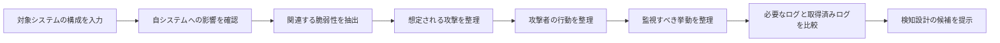
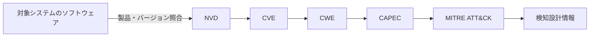
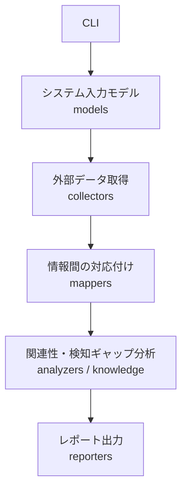
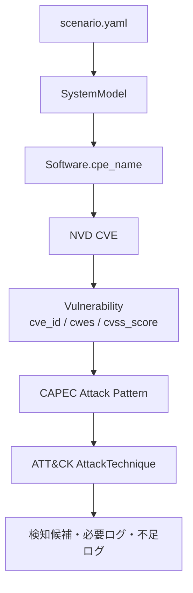
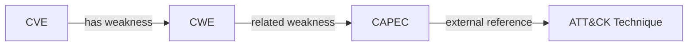

# threat-to-detection 全体設計書

## 1. 目的

脆弱性情報と対象システムの脅威モデルを関連付け、SOCが検知設計を検討するための候補情報を整理する。

このプロジェクトが目指すのは、CVEから検知ルールを完全自動生成することではない。脆弱性から攻撃パターン、攻撃者の行動、必要なログへ至る経路を追跡可能にし、どこまで機械的に整理でき、どこに人の判断が必要かを明らかにすることである。

## 2. 対象読者

- 実装者: どのディレクトリに何を追加するかを確認する
- 分析者: 外部情報がどのように関連付けられるかを確認する
- 課題の読者: 自動化の範囲と限界を確認する

## 3. 現在と将来の区別

### 3.1 現在実装されている内容

- YAMLから対象システムを読み込む
- Pydanticで資産・ソフトウェア・通信経路を検証する
- vendor / product / versionからCPE 2.3を生成する
- NVD CVE APIからCVEを取得する
- CVEからCWE、CVSS、説明を正規化する
- CAPEC XMLからAttack Patternを読み込む
- CAPECの`Related_Weaknesses`を使ってCWEからCAPECを逆引きする
- MITRE ATT&CK EnterpriseのSTIX JSONからTechniqueを読み込む
- ATT&CKのCAPEC外部参照を使ってCAPECからTechniqueを逆引きする

### 3.2 これから実装する内容

- CVE → CWE → CAPEC → ATT&CKの統合サービス
- 対象システムの公開状況・通信経路を使った関連性分析
- ATT&CKや攻撃候補から監視すべき挙動を整理する知識ベース
- 必要ログと取得済みログの差分分析
- Markdown / JSONレポート出力
- CISA KEVなどによる優先度付け

上記の「これから実装する内容」は設計上の拡張候補であり、現在の実装済み機能とは区別する。

## 4. 全体像

この図は、専門用語や実装上のディレクトリ名を知らない読者が、システムの目的と処理の流れを理解するためのものである。



このシステムは、単に脆弱性を一覧表示するのではなく、対象システムに関係する脆弱性を起点に、攻撃と検知設計の検討材料まで段階的に整理する。

## 5. 情報連携の詳細

全体像で示した処理を、今回利用する脆弱性・攻撃情報の体系に対応付ける。



ここで初めてCVE、CWE、CAPEC、MITRE ATT&CKという専門用語を使う。各用語の役割は次のとおりである。

- CVE: 個別の脆弱性
- CWE: 脆弱性の弱点の種類
- CAPEC: 弱点を悪用する攻撃パターン
- MITRE ATT&CK: 攻撃者が取る行動や攻撃手法

## 6. 実装構成

実装者がコードの責務と追加場所を理解するための構成図である。これは初見の読者向けの全体像とは分けて扱う。



実装上の責務やファイル配置の詳細は、各ディレクトリのREADMEに記載する。

## 7. データフロー



各段階の結果は、後続段階が直接Webページを参照せずに扱える共通モデルへ変換する。これにより、外部データの取得と分析ロジックを分離する。

## 8. コンポーネントの責務

| コンポーネント | 責務 | 行わないこと |
|---|---|---|
| `models` | データ構造、型検証、正規化 | API通信、複雑な分析 |
| `collectors` | 外部データの取得、形式の解析、共通モデル化 | 対象システムへの判断 |
| `mappers` | 識別子を使った体系間の対応付け | 攻撃可能性の断定 |
| `knowledge` | 攻撃手法と挙動・ログの対応表 | 外部情報の取得 |
| `analyzers` | 関連性、経路、検知ギャップの分析 | 生データの解析 |
| `services` | 複数段階の実行順序を管理 | 各段階の詳細ロジック |
| `reporters` | 結果の表示形式への変換 | 新しい判断の追加 |
| `examples` | 利用者向けの入力例 | テストの正解データ |
| `tests` | 実装の再現可能な検証 | 本番処理の実行 |

## 9. 入力モデル

対象システムはYAMLで定義する。

```yaml
system:
  metadata:
    name: example-web-system
  assets:
    - name: web-server
      type: server
      software:
        - vendor: example-vendor
          product: example-product
          version: "1.0"
          # cpe: cpe:2.3:a:example-vendor:example-product:1.0:*:*:*:*:*:*:*
      exposed_to:
        - internet
      logs:
        - access_log
        - process_creation
  flows:
    - from: internet
      to: web-server
      protocol: https
```

### 入力上の決定

- `vendor`、`product`、`version`を基本入力とする
- `cpe`を指定した場合は生成値より明示値を優先する
- versionはYAMLで数値化されないよう文字列で記述する
- 外部公開状況と通信経路は、脆弱性の存在と攻撃経路を分けて考えるために保持する
- ログは種類を表す初期モデルであり、将来はコマンドラインや親子プロセスなどの項目へ細分化する

## 10. 外部データソース

| 情報源 | 形式 | 役割 | ローカルで保持するもの |
|---|---|---|---|
| NVD | JSON API 2.0 | 製品・CPEに関連するCVE | APIレスポンスキャッシュ |
| CAPEC | 公式XML | CWEに関連する攻撃パターン | 取得したXMLまたはfixture |
| MITRE ATT&CK | STIX JSON | CAPECに関連するTechniqueとTactic | 取得したSTIX JSONまたはfixture |

外部データは取得時点で内容が変わり得るため、分析結果には可能な限り出典、データバージョン、取得時点を残す。テストでは外部通信を行わず、fixtureを使う。

## 11. 対応付けと不確実性

対応付けは次のグラフとして扱う。



重要な設計上の前提は、対応付けが常に一意ではないことである。

- 1つのCWEから複数のCAPECが得られる
- 1つのCAPECから複数のATT&CK Techniqueが得られる
- 対応が存在しない識別子もある
- 対応が存在しても、対象システムで実際に悪用可能とは限らない

そのため、Mapperは単一の値ではなく候補の集合を返し、将来的には次の情報を保持する。

```text
source_id       対応付け元のID
target_id       対応付け先のID
source          NVD / CAPEC / ATT&CK / manualなど
confidence      確信度
rationale       対応付けの根拠
```

## 12. キャッシュと再現性

- APIレスポンスは`data/cache/`に保存する
- キャッシュは再生成可能な一時データであり、通常Gitへコミットしない
- テストで必要な最小データは`tests/fixtures/`に保存する
- `examples/`は人が実行するための入力、`tests/fixtures/`は自動テストのための固定データとする
- 最新データを取得したい場合はキャッシュを使わないオプションを提供する

## 13. エラー処理

| 状況 | 方針 |
|---|---|
| YAMLの型・必須値が不正 | 入力段階でエラーにする |
| CPEを生成できない | CPE生成エラーとして明示する |
| APIが失敗する | Collector固有のエラーへ変換する |
| APIがレート制限を返す | 指定回数まで待機・再試行する |
| CPE/CAPEC/CWEの対応がない | 空の候補として返し、処理全体は継続する |
| STIX/XMLの形式が不正 | データソース固有の解析エラーにする |

「対応がないこと」と「取得に失敗したこと」は意味が異なるため、同じ空結果に隠さない。

## 14. テスト方針

### 単体テスト

- Pydanticモデルの入力検証
- CPE生成
- NVDレスポンスの正規化
- CAPEC XMLの解析とCWE逆引き
- ATT&CK STIXの解析とCAPEC逆引き
- 0件、1件、複数件の対応

### 統合テスト

将来的に、fixtureを使って次の経路を一つのテストで確認する。


実際の外部APIに依存するテストは作らない。外部データの更新確認は、別の手動または定期処理として扱う。

## 15. 今後の拡張ルール

新しい外部情報源を追加するときは、次の順序を守る。

1. 取得形式と出典をREADMEまたは設計書に記録する
2. rawデータを共通モデルへ変換するCollectorを作る
3. 実データの構造を再現する最小fixtureを追加する
4. 0件・1件・複数件のテストを作る
5. Mapperは候補集合と根拠を保持する
6. AnalyzerやReporterからCollectorを直接呼ばない

これにより、外部データの形式変更が分析処理全体へ直接波及することを防ぐ。

## 16. スコープ外

現時点では次を実装対象外とする。

- すべてのCVEに対する完全自動の攻撃可能性判定
- ATT&CKからの検知ルール完全自動生成
- Sigmaルールの自動配布
- SIEM / EDRとの本格連携
- 実環境の資産情報やログの自動収集
- AIによる最終的な攻撃・検知判断

これらは、候補と根拠を整理できることを確認した後の発展項目である。
